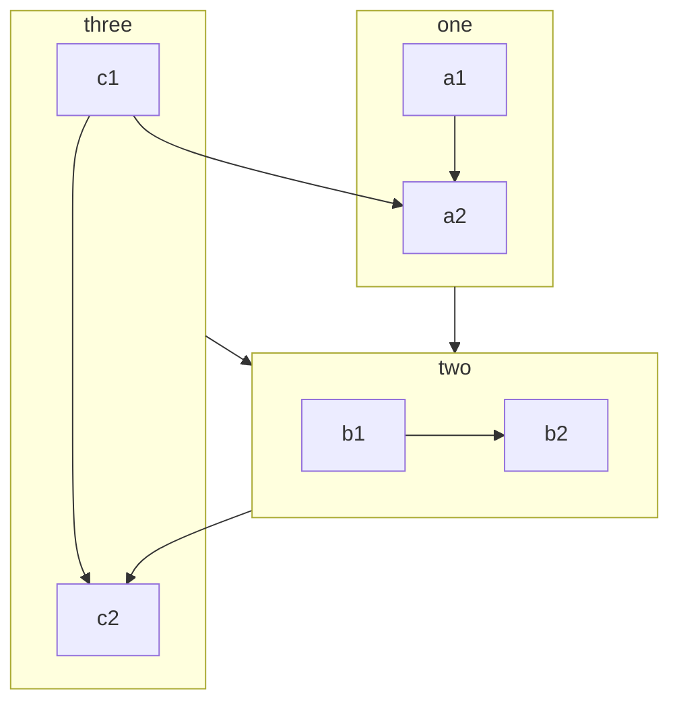
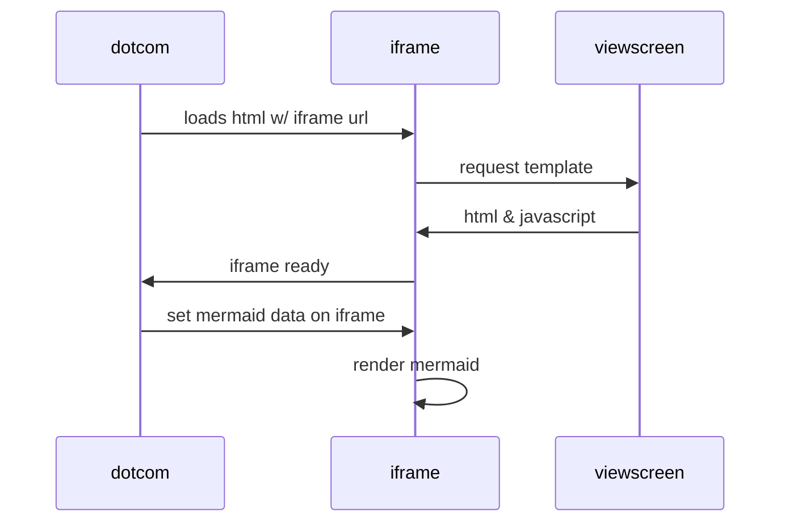
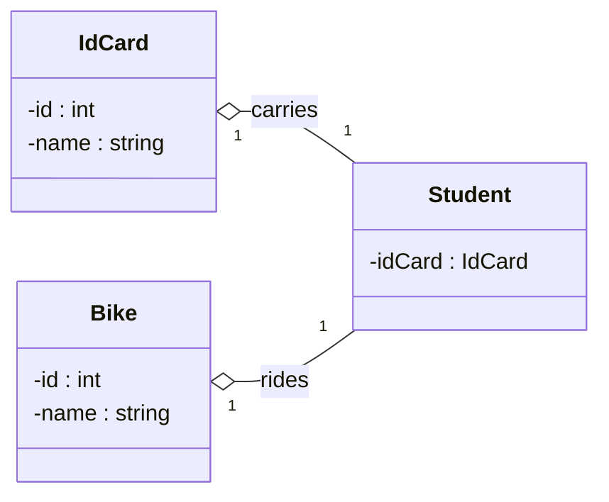
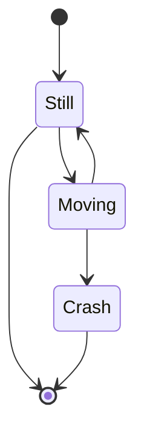
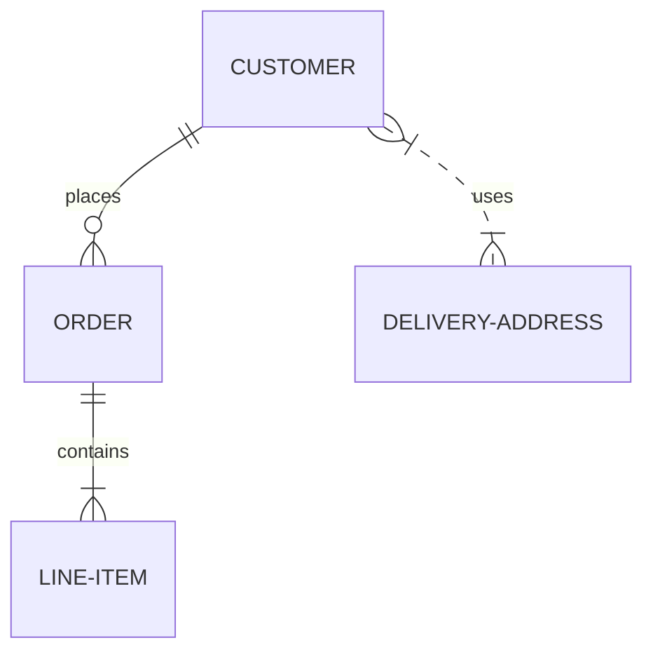
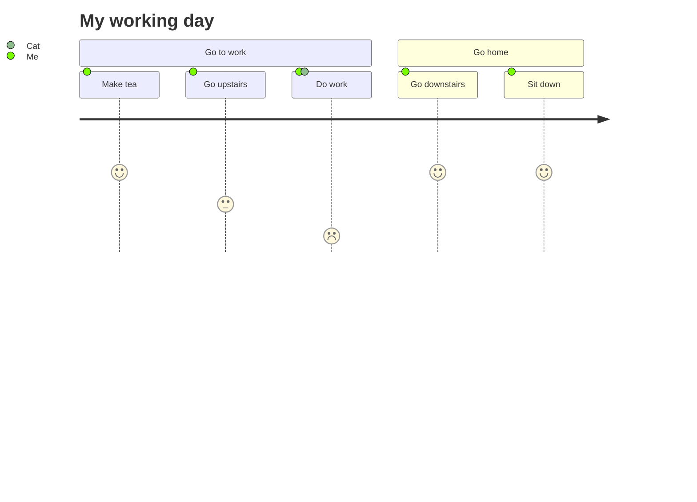
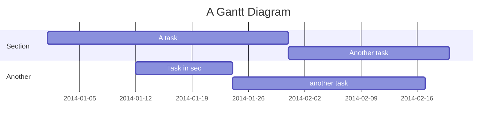
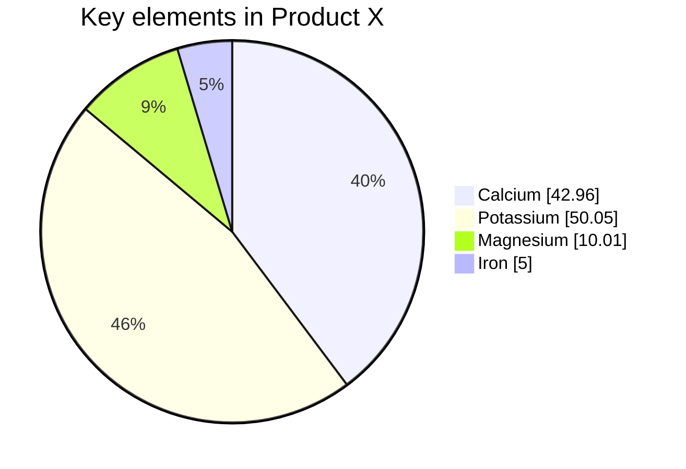
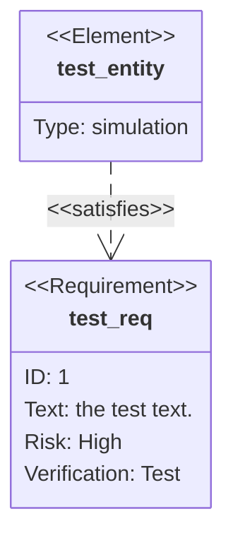
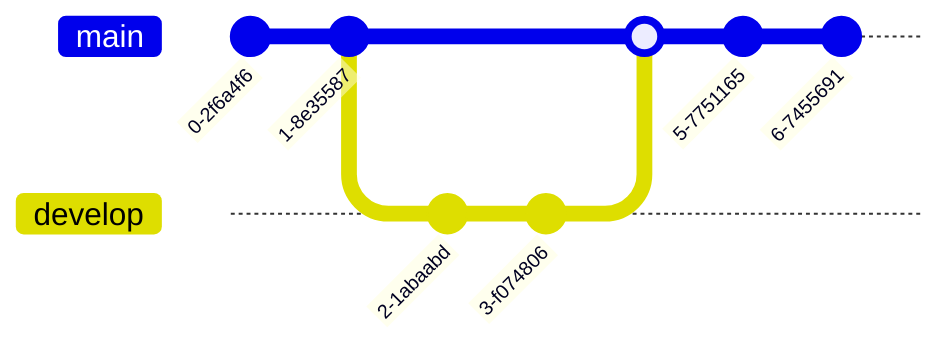

# little-mermaid

## Flowchart

## Sequence Diagram

## Class Diagram

## State Diagram

## Entity Relationship

## User Journey

## Gantt

## Pie chart

## Requirement diagram

## Git graph

